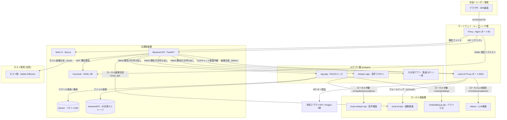

# OpenGENAI コンテナ・アーキテクチャ構成ガイド

本ドキュメントでは、OpenGENAI を構成する全コンテナの役割、配置系統、およびコンテナ間の相互通信フローを整理し、今後の更なるマイクロサービス化・外出し化に向けたシステム全体の現状（As-Is）を明記します。

---

## 1. 全体アーキテクチャ概要

OpenGENAI は、クラウドのマネージドサービス（Amazon Transcribe、S3、Bedrockなど）への依存を排除し、完全閉域網（LGWAN等）での運用や独自ガバナンスの適用を可能にするため、すべての機能を独立した **Docker コンテナ（マイクロサービス）** に分割して構築しています。

Nginx（`proxy`）を単一の入口とし、フロントエンド（`web`）、認証（`keycloak`）、APIゲートウェイおよび調整役としての `backend`、そして個別のビジネスロジックを持つ複数の **AIアプリ（exApps）** がメッシュ状に連携する構成を採っています。

---

## 2. コンテナ役割一覧（全20コンテナの系統別分類）

システムを構成するコンテナ群は、その役割に応じて以下の4つの系統に分類されます。

### ① エントリ・ルーティング系統 (ゲートウェイ層)
ユーザーからのアクセスを受け付け、適切なサービスにルーティングします。

| コンテナ名 | サービス名 | ポート (内部/外部) | 主な役割 |
| :--- | :--- | :--- | :--- |
| `open-genai-proxy` | `proxy` | `80:80` | Nginxによる単一アクセス入口。SSL/TLS終端やリバースプロキシを担当。 |
| `open-genai-litellm` | `litellm` | `4000:4000` | 外部クラウドAPI（Gemini/OpenAI等）およびローカルモデルのマルチプロバイダ・プロキシ。 |

### ② アプリケーション・共通基盤系統
システムのコアロジック、データ永続化、認証認可を担当します。

| コンテナ名 | サービス名 | ポート (内部/外部) | 主な役割 |
| :--- | :--- | :--- | :--- |
| `open-genai-backend` | `backend` | `8000:- (expose)`| FastAPIによるバックエンドAPI。チャット管理、AIアプリ連携、監査等のコア制御。 |
| `open-genai-web` | `web` | `5173:-` | ViteによるNext.js/ReactフロントエンドUI（SPA）。 |
| `open-genai-keycloak` | `keycloak` | `8080:-` | SAML 2.0 認証プロバイダ（IdP）。組織内認証連携を担当。 |
| `open-genai-qdrant` | `qdrant` | `6333:6333` | ベクトルデータベース。RAGドキュメントのベクトル検索。 |
| `open-genai-seaweedfs` | `seaweedfs` | `8333:8333` | S3互換オブジェクトストレージ。成果物ファイルの再ホストと署名付きURL配信。 |

### ③ AIアプリ系統 (exApps)
バックエンドからHMAC認証を経て呼び出される、機能ごとの独立したサービス群です。

| コンテナ名 | サービス名 | ポート (内部/外部) | 主な役割 |
| :--- | :--- | :--- | :--- |
| `open-genai-whisper-app` | `whisper-app` | `8002:8002` | 音声認識のプロキシ・ルーティング層。認証検証と推論中継。 |
| `open-genai-rag-app` | `rag-app` | `8001:8001` | RAG（ドキュメント検索・埋め込み）AIアプリ。非同期バッチ処理を内包。 |
| `open-genai-prompt-app` | `prompt-app` | `8009:-` | プロンプトエンジニアリング・テンプレート管理用AIアプリ。 |
| `open-genai-usermgmt-app` | `usermgmt-app` | `8006:-` | Keycloakと連携した組織・ユーザー管理AIアプリ。 |
| `open-genai-modelpolicy-app`| `modelpolicy-app`| `8007:-` | チーム/グループごとの利用可能モデル制御ポリシーAIアプリ。 |
| `open-genai-ngword-app` | `ngword-app` | `8008:-` | 機微情報・不適切ワードの入力フィルタリングAIアプリ。 |
| `open-genai-audit-app` | `audit-app` | `8005:-` | 監査ログ管理およびガバナンスレポートAIアプリ。 |
| `open-genai-dify-app` | `dify-app` | `8004:-` | Difyなどの外部ローコードツール等と連携するためのアダプタアプリ。 |

### ④ 推論・ベクトル化エンジン系統 (推論層)
実際のディープラーニングモデル（LLM/Embedding/Speech-to-Text/Stable Diffusion）を動作させる心臓部です。

| コンテナ名 | サービス名 | ポート (内部/外部) | 主な役割 |
| :--- | :--- | :--- | :--- |
| `local-whisper-api` | `local-whisper-api`| `8003:8000` | 音声認識推論層。Kotoba-Whisper やオリジナル Whisper の実行環境（GPU/CPU対応）。 |
| `local-sd-api` | `local-sd-api` | `8004:8000` | 画像生成推論層。Stable Diffusionの実行環境。 |
| `open-genai-embedding-jp-api`| `embedding-jp-api`| `8020:8000` | Hugging Face TEI (Text Embeddings Inference) による日本語特化 Embedding (`ruri-v3-30m`等) ベクトル化エンジン。 |
| `open-genai-ollama` | `ollama` | `11434:11434` | ローカル LLM（Qwen2.5 等）の推論実行環境（GPU/CPU対応）。 |

---

## 3. コンテナ間通信フロー図

ユーザーからリクエストが送信されてから、各コンテナがどのように連鎖的に呼び出されるかの全体マップです。

---

## 4. マイクロサービス化の設計指針と実装完了実績

本プロジェクトでは、リソース負荷の偏りに応じて、コンテナ（プロセス）を完全に分離するマイクロサービスアプローチと、逆に無駄な中継層を排除してバックエンドに直接統合するアプローチを最適に使い分けています。

### 4.1 分割と統合のメリット
1. **リソース配置の最適化**:
   * 重い推論コンテナ（`local-whisper-api`、`local-sd-api`）側にのみ GPU やメモリを集中させることができ、Webアプリケーション側（`backend`）のリソースを圧迫しません。
2. **中継コンテナの排除と簡素化**:
   * 画像生成（Stable Diffusion）のように、以前存在していた中継プロキシ（`sd-app`）を廃止し、`backend` の `image_gen.py` コンポーネントにロジックを直接統合することで、無駄なネットワークホップと常時起動プロセス（コンテナ）数を削減し、システム全体を効率化しました。
3. **モデル切り替えの容易性**:
   * 環境変数の設定変更（`.env`）だけで、様々なオープンソースモデルや外部API（LiteLLM経由）をフロント/バックエンドの改修なしに切り替えられます。

### 4.2 実装完了済みのマイクロサービス・統合実績 (As-Is)
* **音声認識 (Whisper) のコンテナ分離と LiteLLM ハブ統合 [対応完了]**:
  * `whisper-app` と `local-whisper-api` へ完全分離し、 `whisper-local` として LiteLLM Proxy へ一元統合を完了。
* **画像生成 (Stable Diffusion / 外部モデル) のバックエンド統合と段階的アップグレード [対応完了]**:
  * `sd-app` コンテナを廃止し、画像生成プロバイダ切り替えおよびヘルスチェック機能を `backend/app/image_gen.py` に直接統合。
  * **任意のコンテナ起動選択（オン/オフ機能）**:
    ローカルでの画像生成が不要（または外部のLiteLLM経由のみ）な環境では、重い `local-sd-api` コンテナの起動をオフに設定可能。起動時には `local-sd-api` が自動検知され機能します。
  * **LiteLLM 自動フォールバック (ハイブリッドハブ)**:
    `imagen-4` でキー未設定時や通信エラー時に、LiteLLM が自動的にローカルの `sd-local` へフェイルオーバー中継する仕組みをサポート。
  * **段階的スケール設計**:
    `SimianLuo/LCM_Dreamshaper_v7` による CPU での超軽量実動検証から、 `ByteDance/SDXL-Lightning` や `black-forest-labs/FLUX.1-schnell` などの高品質ローカルGPU推論への段階的アップグレード手順を整備。
* **LiteLLM Proxy のハブ（軸）化による抽象化 [対応完了]**:
  * すべての AI リクエスト（LLM、音声、画像、埋め込み）を `open-genai-litellm` に集約・ルーティングしておくことで、裏側のモデルや中継構成を切り替える際も、フロントエンドやバックエンドの再ビルドを伴わずに安全にモデルリプレイスが完了します。

---

## 🚀 5. 今後の分割候補と次期ロードマップ (To-Be)

将来的に分離・自立化させることで大きなメリットが得られる拡張候補です。

* **日本語テキスト翻訳特化エンジン (`local-translate-api`) の分離**:
  * 翻訳に特化した軽量なローカルモデル（`facebook/nllb` 等）を実行する専用コンテナを切り出す。
* **RAG用ドキュメント抽出・構造化エンジン (`document-parser-api`) の分離**:
  * 複雑なレイアウト解析や OCR 処理を専用コンテナ（`Unstructured` や `PaddleOCR` 内包）へ外出しする。
* **RAG 埋め込みエンジンの拡張**:
  * `embedding-jp-api` をさらに拡張し、複数のローカル埋め込みモデル（Rerankerなど）を柔軟に差し替え可能にする。
