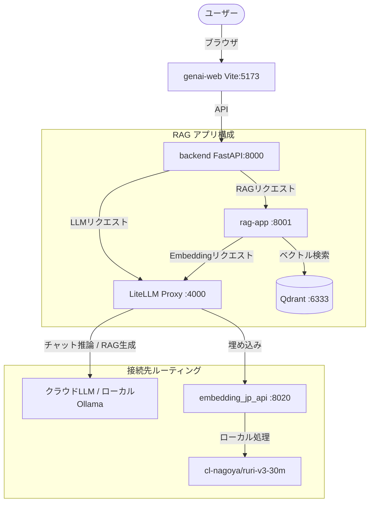

# 🌐 ハイブリッド RAG & マルチプロバイダ構成・導入ガイド

本ガイドでは、**「チャット推論はクラウド LLM（Google Gemini 2.5 等）、埋め込みはローカル日本語特化モデル（`ruri-v3`）」** という、コスト・セキュリティ・精度を両立したハイブリッド構成、および **「ローカル Ollama（Gemma 4 等）とクラウドプロバイダを自由に切り替えるマルチプロバイダ環境」** の構築・設定方法について解説します。

---

## 🗺️ 全体アーキテクチャ

LiteLLM Proxy をハブ（OpenAI 互換サーバー）として配置し、モデル名に基づいてクラウドとローカルへリクエストをルーティングします。



---

## 💻 外部ホスト/ローカルドメインからの接続設定（柔軟なホスト指定）

開発マシン以外の外部PCや、ローカルネットワーク上のホスト名（例: `http://blue-two.local:5173`）からアクセスしたい場合、各設定ファイルを書き換えることなく **ルートの `.env` ファイルのみでホスト変更が可能です。**

### ルートの `.env` 設定例
別PC等の外部ブラウザからアクセスさせる場合、`.env` の末尾で宛先ホストを指定します：

```bash
# --- SAML 認証（backend = SAML SP / Keycloak = SAML IdP）---
# ログイン後に戻るフロントエンドの公開URL
FRONTEND_URL=http://blue-two.local:5173
SAML_SP_ENTITY_ID=http://blue-two.local:8000/auth/saml/metadata
SAML_SP_ACS_URL=http://blue-two.local:8000/auth/saml/acs

# Keycloak 自体のブラウザ公開用URL
KEYCLOAK_HOSTNAME=http://blue-two.local:8088

# --- フロントエンドから見た API エンドポイント ---
VITE_APP_API_ENDPOINT=http://blue-two.local:8000
VITE_APP_TEAM_ACCESS_CONTROL_API_ENDPOINT=http://blue-two.local:8000
```

> [!NOTE]
> 設定変更後、`docker compose up -d web backend keycloak` を実行し、ブラウザ側でスーパーリロード（`Cmd+Shift+R` / `Ctrl+F5`）を行ってください。

---

## ⚠️ 重要：モデル名の命名ルール

> **`model_name` は基本的に設定したモデルIDと完全一致させること**

LiteLLM の `litellm_config.yaml` で設定する `model_name` と、フロントエンドの `VITE_APP_MODEL_IDS` は一致させる必要があります。

```yaml
# litellm_config.yaml ✅ 正しい例
- model_name: gemini-2.5-pro
  litellm_params:
    model: gemini/gemini-2.5-pro
```

```bash
# genai-web/packages/web/.env ✅ 正しい例
VITE_APP_MODEL_IDS=["gemini-2.5-pro","gemini-2.5-flash","gemma4"]
```

UI上で選択したモデルがそのまま LiteLLM を通じてルーティングされます。

### ➕ 任意の新規チャット推論モデルを追加する手順

新たなモデル（例: `my-new-model`）を使いたい場合は、以下の手順で追加できます。

#### ステップ1：`litellm_config.yaml` への追加
[litellm_config.yaml](file:///home/nobuhiko/Project/open-genai/litellm_config.yaml) の `model_list` にモデル定義を追加します。

```yaml
- model_name: my-new-model
  litellm_params:
    model: openai/your-target-model-id  # 接続先APIが求めるモデルID
    custom_llm_provider: openai          # プロバイダの種類
    api_base: "https://your-api-endpoint/v1"
    api_key: "os.environ/YOUR_API_KEY"
```

#### ステップ2：ルートの `.env` への追加
ルートの [`.env`](file:///home/nobuhiko/Project/open-genai/.env) の `VITE_APP_MODEL_IDS` の配列に、LiteLLM で設定した `model_name`（`my-new-model`）を追記します。

```bash
VITE_APP_MODEL_IDS=["my-new-model","gemma4"]
```

#### ステップ3：設定の反映
コンテナを再起動して設定を反映させます。

```bash
# Viteキャッシュの削除（UI選択肢の変更を即座に反映させるため）
rm -rf genai-web/packages/web/node_modules/.vite

# コンテナの再起動
docker compose up -d --force-recreate litellm web
```
> [!NOTE]
> 反映後、ブラウザ側でスーパーリロード（`Cmd+Shift+R` または `Ctrl+F5`）を行ってください。

---

## 🔄 Embeddingモデル変更時のトラブルシューティング

### 利用可能な ruri-v3 モデル一覧

| HuggingFace モデルID | パラメータ数 | 出力次元 | 最大トークン | 特徴 |
|---|---|---|---|---|
| `cl-nagoya/ruri-v3-30m` | 30M | **256** | 8192 | 軽量・高速・ModernBERT-Ja |
| `cl-nagoya/ruri-v3-70m` | 70M | **256** | 8192 | バランス型 |
| `cl-nagoya/ruri-v3-310m` | 310M | **768** | 8192 | 最高精度 |

> ⚠️ **モデルを変えると出力次元数が変わる場合があります。** 次元数が違うと Qdrant への upsert が 400 エラーになります。

---

### 📋 モデル変更の正しい手順

**必ず以下の順序で変更してください：**

#### ステップ1：設定ファイルを更新

```yaml
# litellm_config.yaml
- model_name: cl-nagoya/ruri-v3-310m    # ← 新しいモデルIDに変更
  litellm_params:
    model: openai/cl-nagoya/ruri-v3-310m
    api_base: "http://embedding-jp-api:8000/v1"
    api_key: "not-needed"
```

```bash
# .env
EMBED_MODEL=cl-nagoya/ruri-v3-310m     # ← model_name と一致させる
EMBED_DIM=768                           # ← 新モデルの次元数に変更
EMBED_MODEL_NAME=cl-nagoya/ruri-v3-310m  # ← embedding-jp-api が読み込むモデル
```

#### ステップ2：Qdrant のコレクションを削除

```bash
# 既存コレクションを削除（次元数が変わるため必須）
curl -X DELETE http://localhost:6333/collections/open_genai_rag
```

#### ステップ3：コンテナを再起動

```bash
# embedding-jp-api を新モデルで再ビルド
docker compose up -d --build embedding-jp-api

# LiteLLM を再構成して新しい設定を読み込む
docker compose up -d --force-recreate litellm

# rag-app を再起動して新しい環境変数を反映
docker compose up -d --force-recreate rag-app
```

---

## 🛠️ 設定手順（全体）

### 1. `litellm_config.yaml` の定義

```yaml
model_list:
  # チャット推論：Google Gemini (2026年最新)
  - model_name: gemini-2.5-pro
    litellm_params:
      model: gemini/gemini-2.5-pro
      api_key: "os.environ/GEMINI_API_KEY"

  # チャット推論：ローカルOllama（Gemma 4 8B 最新）
  - model_name: gemma4
    litellm_params:
      model: ollama/gemma4:latest
      api_base: "http://host.docker.internal:11434"

  # 日本語Embedding
  - model_name: cl-nagoya/ruri-v3-30m
    litellm_params:
      model: openai/cl-nagoya/ruri-v3-30m
      api_base: "http://embedding-jp-api:8000/v1"
      api_key: "not-needed"
```

### 2. `.env` の設定

```bash
GEMINI_API_KEY=AIzaSy...
EMBED_MODEL_NAME=cl-nagoya/ruri-v3-30m
EMBED_MODEL=cl-nagoya/ruri-v3-30m
EMBED_DIM=256
DEFAULT_MODEL=gemma4                     # デフォルト使用モデル
RAG_MODEL=gemma4                         # RAG回答生成用モデル
```

### 3. 起動と動作確認

```bash
docker compose up -d --build

# LiteLLM モデル一覧確認
curl http://localhost:4000/v1/models | python3 -m json.tool
```

---

## ⚙️ .env の設定変更を反映する手順

ルートの `.env` や `genai-web/packages/web/.env` を書き換えた際は、コンテナに変更を読み込ませるために以下の再起動手順を行ってください。

### 1. API キーや LiteLLM 接続エンドポイントを変更した場合
さくら AI の API キー/ベースURLや、汎用 OpenAI 互換 (OpenAI Compatible) API の設定を変更した場合は、LiteLLM コンテナを再起動します。

```bash
# 新しい環境変数を読み込んで LiteLLM コンテナを再起動（強制再作成）
docker compose up -d --force-recreate litellm
```

### 2. UI 表示モデル（`VITE_APP_MODEL_IDS`）を変更した場合
チャット画面のモデル一覧（ドロップダウン）の選択肢を変更した場合は、フロントエンド（web）コンテナの再起動とキャッシュクリアを行います。

```bash
# Vite のキャッシュをクリア（キャッシュが残ると表示が変わらない場合があります）
rm -rf genai-web/packages/web/node_modules/.vite

# web コンテナを再起動（強制再作成）
docker compose up -d --force-recreate web
```
> [!NOTE]
> 反映後、ブラウザ側でスーパーリロード（`Cmd+Shift+R` または `Ctrl+F5`）を行ってください。

### 3. ホスト名や外部公開ドメイン（`FRONTEND_URL` / `KEYCLOAK_HOSTNAME`）を変更した場合
アクセス元のURLや SAML 認証（Keycloak）のホスト名を変更した場合は、認証・フロント・バックエンドの一連のコンテナを再起動します。

```bash
# 影響するコンテナを一斉に再起動
docker compose up -d --force-recreate web backend keycloak
```
