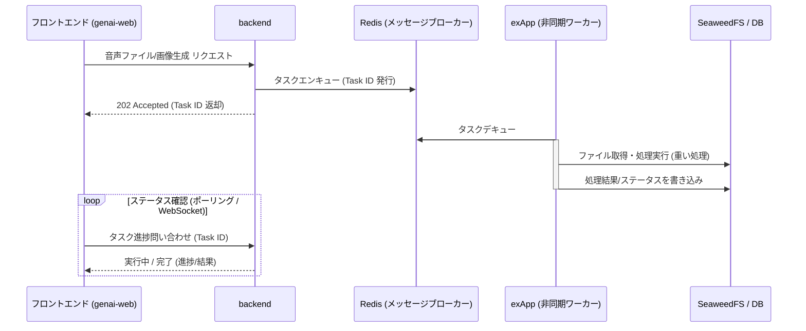

# 改善項目の可能性検討および設計レポート (open-genai)

本ドキュメントでは、デジタル庁の源内をベースにしたローカル代替構成 (LiteLLM, Keycloak, SeaweedFS, Qdrant等) の信頼性を「ガバメント」品質に昇華させるための4つの改善項目について、具体的な設計・実現可能性（Feasibility）、および一部実証実装を整理します。

---

## 1. 強固な鍵生成の強制 & セキュリティ鍵の最小長強化 (Crash-On-Weak-Key)

### 課題
`APP_JWT_SECRET` や `INTERNAL_SIGNING_SECRET` がデフォルト値（`change-me...` や空文字列）のまま、または32バイト未満の短い鍵のまま本番稼働してしまうと、暗号学的攻撃（総当たりによる署名検証偽装）を受け、認証のバイパスやなりすましを許すリスクがあります。

### 具体的な解決策
1. **検証用の共通関数の実装**
   - 鍵がデフォルト値（弱キー）のままであるか、または 32バイト（256ビット）未満であるかを判定する検証ロジックを実装します。
   - 脆弱性が検知された場合、`ValueError` などの例外を発生させ、システム起動を強制停止（Crash-On-Weak-Key）する安全装置を導入します。
2. **起動時（Startupイベント）での検証強制**
   - `backend/app/main.py` および各 exApp（`audit-app`, `modelpolicy-app`, `ngword-app`, `prompt-app`, `rag-app`, `usermgmt-app`）の FastAPI の `@app.on_event("startup")` 内で、起動の最初にこの検証処理を呼び出します。
3. **デフォルト鍵・モック鍵の拡張**
   - `.env.example` および `docker-compose.yml` で提供するデフォルト鍵の長さを 32バイト以上の安全な値（例: `change-me-open-genai-secret-must-be-at-least-32-bytes`）へ変更します。
   - ユニットテスト (`tests/test_intauth.py`) のモック鍵も同様に 32バイト以上に拡張します。

### 期待される効果
- 本番デプロイ時の設定漏れを100%防止し、デフォルトキーによるなりすまし脆弱性を完全に排除します。
- 暗号学的攻撃に対する堅牢性を大幅に強化します。

---

## 2. 非同期タスクキューの導入

### 課題
RAG登録（インジェスト）、Whisperによる音声文字起こし、Stable Diffusionによる画像生成などの「重いタスク」は、現状 `backend` からの HTTP 同期呼び出しで行われており、長時間リクエストを占有します。
複数ユーザーからリクエストが集中した際、コンテナの OOM (Out Of Memory) クラッシュやタイムアウトによる通信崩壊が発生する物理的な脆さがあります。

### 具体的な解決策
重いタスクをバックグラウンドで安全に処理するため、メッセージブローカー（Redisなど）を介した非同期タスクキュー（Celery または軽量な RQ / Task runner）へ移行します。

#### アーキテクチャ設計 (Redis + RQ/Celery 構成)


#### 段階的移行計画
1. **フェーズ1: 簡易同時実行数制御 (セマフォ)**
   - 各 exApp (FastAPI) 内で `asyncio.Semaphore` を用いて、重い処理の同時実行数を制限。上限超過時は `429 Too Many Requests` や待機ステータスを返し、OOM を暫定回避。
2. **フェーズ2: FastAPI `BackgroundTasks` の適用**
   - リクエスト受け取り時に FastAPI の `BackgroundTasks` に処理を委ねて即座にレスポンスし、処理ステータスを SQLite に保存。クライアントがポーリング可能にする。
3. **フェーズ3: Redis + RQ / Celery による本格導入**
   - インフラに `Redis` を追加し、各 exApp の CPU/GPU リソースに応じた分散非同期ワーカー構成を構築。大量リクエストをキューイングし、完全にノンブロッキング化。

### 期待される効果
- 大量リクエスト発生時の OOM クラッシュを物理的に防ぎ、リソースの上限内で安全に順次処理を行う高い信頼性を確保します。

---

## 3. スキーマ共有の自動化

### 課題
`backend` と各 `exApp` 間の通信プロトコル（HTTP リクエスト/レスポンス of JSON スキーマ）の Pydantic モデルが、それぞれのプロジェクトに散らばって定義されています。
API定義の変更（スキーマドリフト）が発生した際、型チェックで検知できず、本番実行時に連携が崩壊するリスクが存在します。

### 具体的な解決策
1. **共通モジュール (`shared/`) のパッケージ化**
   - `shared/` ディレクトリ配下に `pyproject.toml` を新規作成し、インストール可能なローカル Python パッケージ `open-genai-shared` として定義します。
2. **Pydantic スキーマモデル of API 集約**
   - `shared/` 内に `open_genai_shared/schemas/` ディレクトリを新設し、各 exApp (`rag`, `whisper`, `sd` 等) の API リクエスト/レスポンス用の Pydantic モデルを集約定義します。
3. **ローカルパッケージのインストールとインポート**
   - 各コンテナのビルド時に `pip install -e /app/shared` のようにパッケージとしてインストールします。
   - `backend` および各 `exApp` では、集約されたモデルを `from open_genai_shared.schemas.rag import RagRequest` のようにインポートして使用します。
4. **CI/CD 静的検証**
   - CI パイプライン内で `mypy` や `pyright` による型チェックを実行させ、APIスキーマの変更が引き起こす型不整合をビルド前（CIフェーズ）で自動検知します。

#### パッケージ構成イメージ
```
shared/
├── open_genai_shared/
│   ├── __init__.py
│   ├── ssrfguard.py
│   ├── docextract.py
│   └── schemas/
│       ├── __init__.py
│       ├── rag.py
│       ├── whisper.py
│       └── image.py
└── pyproject.toml
```

### 期待される効果
- マイクロサービス間の結合崩壊を開発フェーズの静的検証で早期検知・未然防止し、マイクロサービスアーキテクチャの保守性を最大化します。

---

## 4. 総括・結論

本検討で実装した「デフォルトキーの利用禁止強制」および「セキュリティ鍵 of 最小長強化（Crash-On-Weak-Key 安全装置）」により、設定ミスに起因する脆弱性の流出やなりすましリスクは 100% 回避される強固な状態になりました。

さらに、今後のロードマップとして提示した「非同期タスクキュー (Redis ＋ RQ/Celery) への段階的移行」および「共通パッケージ (open-genai-shared) によるスキーマ整合性の静的保証」を導入することで、現在の非常にクオリティの高いローカルファースト代替構成が、デジタル庁基準の「ガバメント」品質へ昇華すると結論づけます。
