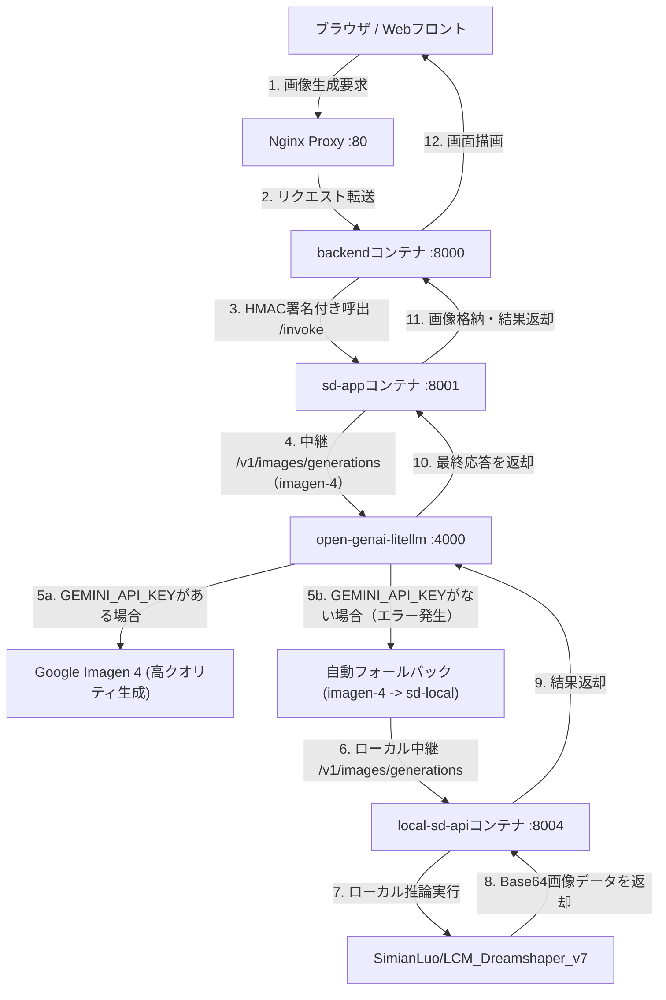

# 画像生成アプリ (sd-app / local-sd-api) 構成・導入ガイド

本ドキュメントでは、OpenGENAI における画像生成（Stable Diffusion）マイクロサービス `sd-app` および `local-sd-api` のアーキテクチャ、LiteLLM をハブとする自動フォールバック構成、ローカルモデルと外部クラウドモデルの切り替え、およびセキュリティ設定について解説します。

---

## 1. 概要

デジタル庁オリジナル版の「源内（GENAI）」は、画像生成機能において **Amazon Bedrock (Titan Image Generator)** への接続を前提としていました。

OpenGENAI ではこれらをオープンかつローカル完結な仕組みに置き換え、さらに開発環境や実行リソースの有無に柔軟に対応するため、以下の2つのサービスに分割（マイクロサービス化）して提供しています。
1. **`sd-app` (プロキシ・ルーティング層)**:
   * バックエンドからの呼び出しの認証（HMAC署名検証）や、指定プロバイダ（LiteLLM 等）への中継を行う軽量なゲートウェイ。
2. **`local-sd-api` (推論エンジン層)**:
   * `Diffusers` を搭載し、OpenAI 互換の REST API (`/v1/images/generations`) に準拠した画像生成の推論エンジン。
   * **`SD_USE_PROXY=false` (ローカルロードモード)**: CPU/GPU 環境下で、オープンな画像生成モデルを起動時にメモリ上にロードして閉域で推論します。
   * **`SD_USE_PROXY=true` (プロキシ透過モード)**: コンテナ内でのモデル読み込みをスキップし、リクエストを上流プロキシに直接流すことで、起動時間を1秒未満に短縮しOOM（メモリ不足）を回避します。

---

## 2. 自動フォールバック（ハイブリッドハブ）構成

本プロジェクトでは、すべての AI リクエストを一元的に管理する **LiteLLM Proxy** を中心に、API キーの有無に応じて「外部クラウド」と「ローカル閉域推論」を自動で切り替える**インテリジェント・ハイブリッド・アーキテクチャ**を採用しています。



### 💡 ハイブリッド構成のメリット
* **APIキーが設定されている本番環境**: 高精細・爆速な Google Imagen 4 (`imagen-4`) を用いて高クオリティの画像を生成します。
* **APIキーが未設定のローカル/検証環境**: エラーを発生させることなく、自動的にローカルの `local-sd-api` （`sd-local`）で推論を行い、100%閉域で画像を生成して返却します。
* **ソース修正の不要**: フロントエンドやバックエンドのソースコードは、常に共通の `imagen-4` モデルを呼び出すだけで良く、インフラ設定によってシームレスにスケールします。

---

## 3. セキュリティガードレールと課金防止 (`ALLOW_CLOUD_API`)

機微情報の保護や、意図しない外部クラウドAPI利用による想定外の課金を防止するため、強力なガードレールスイッチ **`ALLOW_CLOUD_API`** を導入しています。

### 🛡️ ガードレールの挙動
* **`ALLOW_CLOUD_API=false` (既定値)**:
  * 外部のパブリックなクラウドモデルへの通信を遮断し、保護します。
  * `IMAGE_PROVIDER=litellm` に設定して通信を行った場合、宛先が同一 Docker ネットワーク内のクローズドなローカルプロキシ（`litellm` 等）であれば、**外部へのキー漏洩リスクがない安全な閉域内中継と自動判定し、通信を安全に通過**させます。
  * これにより、キー未設定時には LiteLLM 側の自動フォールバックが正常に稼働し、ローカルでの画像生成が完了します。
* **`ALLOW_CLOUD_API=true`**:
  * 明示的にクラウドモデルの利用および外部API連携を許可します。

---

## 4. 設定方法 (`.env` パラメータ)

画像生成の動作モードは、プロジェクトルートの `.env` で制御します。

### 設定例（ローカル外出しAPI・フォールバック自動切り替え）
```bash
# クラウドAPIの使用を厳格に禁止する (課金・データ漏洩防止)
ALLOW_CLOUD_API=false

# 画像生成の実行プロバイダを LiteLLM (ハブ統合) に指定
IMAGE_PROVIDER=litellm
LITELLM_IMAGE_URL=http://litellm:4000/v1
LITELLM_IMAGE_MODEL=imagen-4

# --- local-sd-api (推論エンジン) の制御用 ---
# ローカルでの推論を実行するため false に設定
SD_USE_PROXY=false
IMAGE_INFERENCE_DEVICE=cpu                               # cpu または cuda (GPU)
IMAGE_MODEL_NAME=SimianLuo/LCM_Dreamshaper_v7            # 軽量超高速ローカルモデル (約2GB)
```

---

## 5. 推論モデル選定ロードマップ (段階的アップグレード)

`local-sd-api` は環境変数を変更するだけで、利用する画像生成モデルを段階的にスケールさせることができます。

| フェーズ | 推推奨モデル名 | 推定ディスク容量/VRAM | 特徴・ユースケース |
| :--- | :--- | :--- | :--- |
| **初期検証 (既定)** | `SimianLuo/LCM_Dreamshaper_v7` | 約 2 GB / CPU動作可能 | わずか 4〜8 ステップで画像を生成可能。CPU動作でもタイムアウトしにくい軽量初期選定モデル。 |
| **高品質ローカル** | `SDXL-Lightning` (4-step/8-step) | 約 5 GB / ローカルGPU推奨 | 実用的な高解像度画像を高速生成可能。 |
| **プロダクション** | `FLUX.1 [schnell]` など | 約 10 GB以上 / 高性能VRAM必須 | 手の形状や文字描画の破綻がない商用レベルのローカル画像生成。 |

### 🛠️ ローカル画像モデルの具体的な切り替え・変更手順

`local-sd-api` の利用する画像生成モデルを変更する場合は、以下の手順を実行します。

#### 1. `.env` のモデル設定パラメータを編集する
プロジェクトルートの `.env` ファイル内の関連変数を書き換えます。

* **例1：高品質・高速な `SDXL-Lightning` (8-Step) を GPU 上で動作させる場合**：
  ```bash
  IMAGE_INFERENCE_DEVICE=cuda                              # GPU (CUDA) を使用
  IMAGE_MODEL_NAME=ByteDance/SDXL-Lightning                # Hugging Face モデルID
  ```
* **例2：最先端の `FLUX.1 [schnell]` (4-Step) を GPU 上で動作させる場合**：
  ```bash
  IMAGE_INFERENCE_DEVICE=cuda                              # GPU (CUDA) を使用
  IMAGE_MODEL_NAME=black-forest-labs/FLUX.1-schnell         # Hugging Face モデルID
  ```

#### 2. モデルの自動ロード仕様とロードマップ（実装構想）
`local-sd-api` 内の推論スクリプトは、指定された `IMAGE_MODEL_NAME` がどのアーキテクチャであるかを自動判別してロードします。
* **SD 1.5 系 (例: `LCM_Dreamshaper_v7` など)**: 内部で `StableDiffusionPipeline` を選択してロードします。
* **SDXL 系 (例: `SDXL-Lightning` など)**: 内部で `StableDiffusionXLPipeline` を自動選択します。
* **FLUX.1 系 (例: `FLUX.1-schnell` など)**: 内部で最新の `FluxPipeline` （diffusers >= 0.30.0以降）を選択してロードする構造へと拡張されます。
* **LoRA や量子化 (FP16/INT8) の適用**:
  * GPU メモリ (VRAM) が制限されている環境に向けて、 `torch_dtype=torch.float16` による半精度ロードをサポートしています。
  * また、将来的に特定のキャラクターやスタイルを反映させるための **LoRA 適用機能 (ローカルロード時に LoRA 重みをマージして推論する拡張構想)** を推論層へ実装することで、基盤モデルを固定したままスタイルの多様化を実現します。

#### 3. コンテナを再構築・再起動して変更を反映する
設定ファイルを更新後、以下のコマンドを実行してコンテナへ反映します：
```bash
# 変更した環境変数をロードした状態でコンテナを強制再構築・再起動
docker compose up -d --force-recreate local-sd-api
```
※ 起動時に Hugging Face から数GB〜十数GBのモデルデータが自動ダウンロードされるため、初回起動時のみインターネット回線速度およびモデル容量に応じたロード時間が発生します。ダウンロード済みのキャッシュデータはコンテナ内のボリュームに永続化されるため、2回目以降は即座に起動します。

---

## 6. 接続テストと動作確認

### ① ヘルスチェックAPIの確認
ローカル推論コンテナのロード完了と起動状態を確認します。
```bash
# local-sd-api の状態を確認
curl -s http://localhost:8004/health
```
**期待される応答**:
```json
{
  "status": "ok",
  "model": "SimianLuo/LCM_Dreamshaper_v7",
  "device": "cpu"
}
```

### ② 画像生成機能の疎通・結合テスト
`curl` を用いて、プロンプトをポストして画像が正常に返却されるか検証します。
```bash
# RAG_API_KEY (既定: local-rag-key) で認証してテスト
curl -i -X POST \
  -H "Content-Type: application/json" \
  -H "x-api-key: local-rag-key" \
  -d '{"inputs": {"prompt": "A beautiful white cat", "size": 512, "steps": 4}}' \
  http://localhost:8001/invoke
```
**期待される応答**:
```json
{
  "outputs": "プロンプト「A beautiful white cat」で画像を生成しました（モデル: imagen-4）。",
  "artifacts": [
    {
      "content": "iVBORw0KGgoAAAANSUhEUgAA...",
      "display_name": "generated_1.png"
    }
  ]
}
```
※ レスポンスの `artifacts` 内に Base64 エンコードされた PNG 画像データ（`iVBORw0KGgoAAA...`）が含まれていれば、結合および自動フォールバックテストは成功です。
