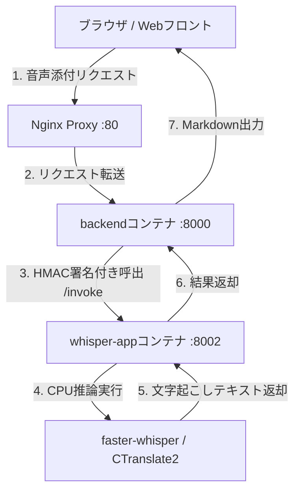
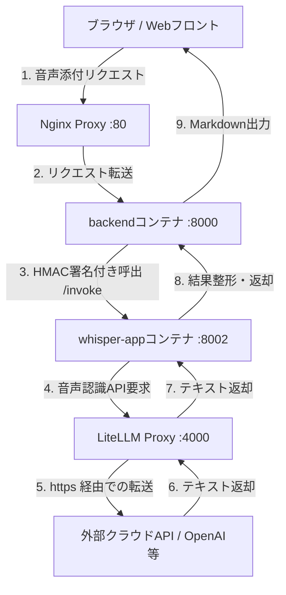

# 音声認識アプリ (whisper-app) 構成・導入ガイド

本ドキュメントでは、OpenGENAI における音声認識（文字起こし）マイクロサービス `whisper-app` のアーキテクチャ、呼び出し構成、ローカルとクラウドの切り替え方法、およびセキュリティ設定について解説します。

---

## 1. 概要

デジタル庁オリジナル版の「源内（GENAI）」は、音声の文字起こし機能において **Amazon Transcribe** および **Amazon S3** を前提としたクラウドマネージドな構成で実装されていました。

OpenGENAI ではこれらをオープンかつローカル完結な仕組みに置き換えるため、独立したマイクロサービス **`whisper-app`** を導入しています。
`whisper-app` は、環境変数（`.env`）の切り替えにより、コンテナ内部での **「ローカル実行」** と、LiteLLM Proxy を中継した **「クラウド連携実行」** の2種類を選択可能です。

---

## 2. 呼び出し構成とアーキテクチャ

`whisper-app` は、フロントエンドからの要求を `backend` が中継し、HMAC署名による内部認証（`intauth`）を経て呼び出されます。

### ① 完全ローカル完結構成 (`WHISPER_PROVIDER=local`)
外部ネットワークやクラウドAPIへ一切データを送信せず、コンテナローカルで文字起こしを実行する安全な構成です。閉域網（LGWAN等）での運用に適しています。



* **特徴**:
  * 推論エンジンには高速な `faster-whisper` (CTranslate2) を採用し、CPU上でも実用的な速度で動作します。
  * 初回実行時に、指定した Whisper モデル（既定: `medium`）が自動的にダウンロードされ、 `whisper_cache` ボリュームにキャッシュされます。以降はオフラインで動作します。

---

### ② クラウド/外部API連携構成 (`WHISPER_PROVIDER=litellm`)
高精度なクラウド音声認識API（OpenAI `gpt-4o-transcribe` や、国内完結のさくらAIなど）を、 **LiteLLM Proxy** を経由して中継呼び出しするハイブリッド構成です。



* **特徴**:
  * `whisper-app` が受け取った音声ファイルを、LiteLLMの `/v1/audio/transcriptions` 規格に合わせて転送します。
  * 外部APIキーやルーティング設定はすべて `LiteLLM Proxy` で一元管理されるため、個別のコンテナに直接APIキーを設定する必要がなくセキュアです。

---

## 3. セキュリティガードレールと課金防止 (`ALLOW_CLOUD_API`)

クラウドAPIの利用を制限したい環境（完全閉域網、あるいは予期しないクラウドAPI利用による想定外の課金を防止したい場合）のため、強力なガードレールスイッチ **`ALLOW_CLOUD_API`** を導入しています。

### 🛡️ ガードレールの挙動

* **`ALLOW_CLOUD_API=false` (既定値)**:
  * 意図しない外部課金やデータ流出を防ぐため、すべての外部API通信要求をブロックまたは安全に強制フォールバックさせます。
  * `.env` で `WHISPER_PROVIDER=litellm` (クラウド設定) が指定されていたとしても、 `whisper-app` が起動時およびリクエスト時に自動検知し、 **強制的に `local` プロバイダ (faster-whisper によるコンテナ内推論) にフォールバック** させます。これにより、誤設定によるクラウド課金や送信を100%防止します。
  * 同時に、 `backend` に対するチャット推論等で外部クラウドモデル（`gemini-` 等）が要求された場合も、バックエンド側で `403 Forbidden` としてリクエストを即時遮断します。

* **`ALLOW_CLOUD_API=true`**:
  * 明示的にクラウドモデルの利用および `whisper-app` ➔ LiteLLM ➔ クラウドAPIへの中継連携を許可します。

---

## 4. 設定方法 (`.env` パラメータ)

`whisper-app` の動作モードは、プロジェクトルートの `.env` で制御します。

### 設定例（完全ローカル完結モード - 推奨・安全）
```bash
# クラウドAPIの使用を厳格に禁止する (課金・データ漏洩防止ガード)
ALLOW_CLOUD_API=false

# 音声認識の実行プロバイダ (ALLOW_CLOUD_API=false時は強制的にlocalとして動きます)
WHISPER_PROVIDER=local

# ローカル実行時のモデル設定
WHISPER_MODEL=medium        # small / medium / large-v3 から選択
WHISPER_COMPUTE=int8
WHISPER_DEVICE=cpu
```

### 設定例（外部クラウド連携モード）
```bash
# クラウドAPIの利用を明示的に許可する
ALLOW_CLOUD_API=true

# 音声認識の実行プロバイダを LiteLLM 中継に変更
WHISPER_PROVIDER=litellm

# 中継先モデルおよびエンドポイントの設定
LITELLM_AUDIO_MODEL=whisper-cloud
LITELLM_AUDIO_URL=http://litellm:4000/v1
LITELLM_API_KEY=not-needed

# (必須) LiteLLM Proxy が使用する外部APIキーを設定
OPENAI_API_KEY=sk-...
```

---

## 5. 接続テストと動作確認

### ① ヘルスチェックAPIの確認
コンテナが正常起動しているか、および現在適用されているプロバイダを確認します。
```bash
curl -s http://localhost/api/health
# または直接 whisper-app のポートを叩く
curl -s http://localhost:8002/health
```
**期待される応答 (ALLOW_CLOUD_API=false 時)**:
```json
{
  "status": "ok",
  "model": "medium",
  "loaded": true,
  "provider": "local"
}
```
※ `.env` で `WHISPER_PROVIDER=litellm` を指定していても、ガードにより `"provider": "local"` になっていることが確認できます。

### ② 文字起こし機能の疎通確認
`curl` を用いて、音声ファイルを添付したダミーリクエストを `/invoke` エンドポイントにポストして検証します。
```bash
# RAG_API_KEY (既定: local-rag-key) で認証してテスト
curl -i -X POST \
  -H "Content-Type: application/json" \
  -H "x-api-key: local-rag-key" \
  -d '{"inputs": {"language": "ja", "files": []}}' \
  http://localhost:8002/invoke
```
※ 音声が添付されていない場合は `{"outputs": "音声ファイルが添付されていません。音声を添付してください。"}` という正常なフォールバック応答が返ります。
