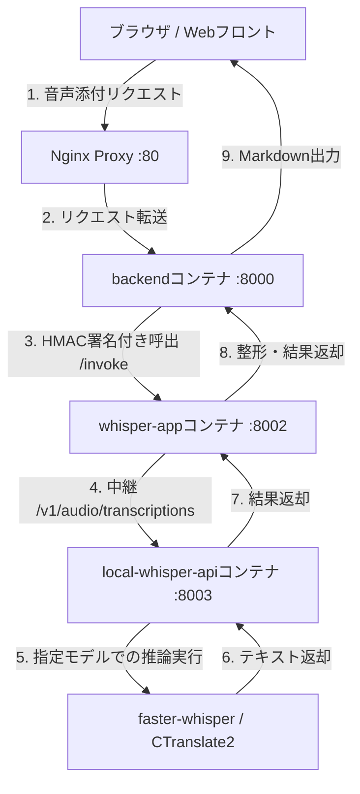

# 音声認識アプリ (whisper-app / local-whisper-api) 構成・導入ガイド

本ドキュメントでは、OpenGENAI における音声認識（文字起こし）マイクロサービス `whisper-app` および `local-whisper-api` のアーキテクチャ、呼び出し構成、ローカルモデルとクラウドモデルの切り替え、およびセキュリティ設定について解説します。

---

## 1. 概要

デジタル庁オリジナル版の「源内（GENAI）」は、音声の文字起こし機能において **Amazon Transcribe** および **Amazon S3** を前提としたクラウドマネージドな構成で実装されていました。

OpenGENAI ではこれらをオープンかつローカル完結な仕組みに置き換え、さらに推論ワークロードを柔軟にコントロールするために、以下の2つのサービスに分割（マイクロサービス化）して提供しています。
1. **`whisper-app` (プロキシ・ルーティング層)**:
   * バックエンドからの呼び出しの認証（HMAC署名検証）や、指定プロバイダへのルーティングを行う軽量なゲートウェイ。
2. **`local-whisper-api` (推論エンジン層)**:
   * `faster-whisper` (CTranslate2) を搭載し、OpenAI 互換の REST API (`/v1/audio/transcriptions`) に準拠した音声認識の心臓部。
   * ホストサーバーにGPUがある場合はGPU推論、ない場合はCPU推論と、コンテナ単位でリソースや量子化を自在に切り替え可能。
   * 日本語特化の **Kotoba-Whisper** と、多言語・高精度な **オリジナル Whisper** の双方を環境変数だけで切り替え可能。

---

## 2. 呼び出し構成とアーキテクチャ

音声認識処理の実行プロバイダは、 `.env` の `WHISPER_PROVIDER` で制御します。

### ① ローカル外出しAPI構成 (`WHISPER_PROVIDER=local_api` - 推奨)
実際の重い音声認識処理を別コンテナ `local-whisper-api` に委譲し、環境に合わせて CPU/GPU や利用モデルを自在に切り替える構成です。外部ネットワークやクラウドAPIへ一切データを送信しません。



* **特徴**:
  * 推論エンジンコンテナを分離したことで、フロントやバックエンドの構成に影響を与えることなく、音声認識エンジン側だけに GPU (CUDA) を割り当てることが可能です。
  * `AUDIO_MODEL_NAME` に任意の Hugging Face 互換モデル名（`systran/faster-whisper-*` や `kotoba-tech/kotoba-whisper-*`）を指定するだけで、自動ダウンロードされてロードされます。

---

### ② 既存のコンテナ内実行構成 (`WHISPER_PROVIDER=local`)
プロキシコンテナ（`whisper-app`）の内部で直接 `faster-whisper` による推論を行う、シンプルな1コンテナ構成です（CPU推論のみ）。

### ③ クラウド/外部API連携構成 (`WHISPER_PROVIDER=litellm`)
高精度なクラウド音声認識API（OpenAI `gpt-4o-transcribe` や、国内完結のさくらAIなど）を、 **LiteLLM Proxy** を経由して中継呼び出しするハイブリッド構成です。

---

## 3. セキュリティガードレールと課金防止 (`ALLOW_CLOUD_API`)

閉域網（LGWAN等）での運用や、意図しない外部クラウドAPI利用による想定外の課金を防止するため、強力なガードレールスイッチ **`ALLOW_CLOUD_API`** を導入しています。

### 🛡️ ガードレールの挙動

* **`ALLOW_CLOUD_API=false` (既定値)**:
  * 外部のクラウドモデル（Geminiや外部OpenAI等）への通信を遮断し、保護します。
  * `WHISPER_PROVIDER=litellm` (クラウド設定) が指定されていたとしても、 `whisper-app` が自動検知し、 **強制的に `local` プロバイダにフォールバック** させて外部送信を100%防止します。
  * 一方、 `WHISPER_PROVIDER=local_api` への通信は **同一Dockerネットワーク内のコンテナ間ローカル通信であるため、ブロックせずに安全に通す** ロジックになっています。

* **`ALLOW_CLOUD_API=true`**:
  * 明示的にクラウドモデルの利用および外部API連携を許可します。

---

## 4. 設定方法 (`.env` パラメータ)

音声認識の動作モードは、プロジェクトルートの `.env` で制御します。

### 設定例（ローカル外出しAPI・Kotoba-Whisperを使用する場合）
```bash
# クラウドAPIの使用を厳格に禁止する (課金・データ漏洩防止)
ALLOW_CLOUD_API=false

# 音声認識の実行プロバイダをローカル外出しAPIに指定
WHISPER_PROVIDER=local_api
WHISPER_API_URL=http://local-whisper-api:8000/v1/audio/transcriptions

# --- local-whisper-api (新コンテナ) のリソース・モデル制御 ---
AUDIO_INFERENCE_DEVICE=cpu                               # cpu または cuda (GPU)
AUDIO_COMPUTE_TYPE=int8                                  # int8, float16 など
AUDIO_MODEL_NAME=kotoba-tech/kotoba-whisper-v1.0-faster  # 日本語特化モデル
```

### 設定例（ローカル外出しAPI・オリジナル Whisper Large v3を使用する場合）
```bash
ALLOW_CLOUD_API=false
WHISPER_PROVIDER=local_api
WHISPER_API_URL=http://local-whisper-api:8000/v1/audio/transcriptions

# オリジナル Whisper Large v3 を指定
AUDIO_INFERENCE_DEVICE=cpu
AUDIO_COMPUTE_TYPE=int8
AUDIO_MODEL_NAME=systran/faster-whisper-large-v3
```

---

## 5. 接続テストと動作確認

### ① ヘルスチェックAPIの確認
コンテナが正常起動しているか、および現在ロードされている音声認識モデルを確認します。
```bash
# local-whisper-api の状態を確認
curl -s http://localhost:8003/health
```
**期待される応答**:
```json
{
  "status": "ok",
  "model": "kotoba-tech/kotoba-whisper-v1.0-faster",
  "device": "cpu",
  "compute_type": "int8"
}
```

### ② プロキシ層の状態確認
```bash
# whisper-app の状態を確認
curl -s http://localhost:8002/health
```
**期待される応答**:
```json
{
  "status": "ok",
  "model": "medium",
  "loaded": false,
  "provider": "local_api"
}
```

### ③ 文字起こし機能の疎通・結合テスト
`curl` を用いて、音声ファイルを添付したダミーリクエストを `/invoke` エンドポイントにポストして検証します。
```bash
# RAG_API_KEY (既定: local-rag-key) で認証してテスト
curl -i -X POST \
  -H "Content-Type: application/json" \
  -H "x-api-key: local-rag-key" \
  -d '{"inputs": {"language": "ja", "files": [{"files": [{"filename": "test.wav", "content": "UklGRigAAABXQVZFZm10IBIAAAABAAEARKwAAIhYAQACABAAAABkYXRhAAAAAA=="}]}]}}' \
  http://localhost:8002/invoke
```
**期待される応答**:
```json
{"outputs":"**文字起こし結果 (ローカルAPI)**:\n\n"}
```
※ 正常に中継され、レスポンスに `(ローカルAPI)` が含まれていれば、結合疎通テストは成功です。
